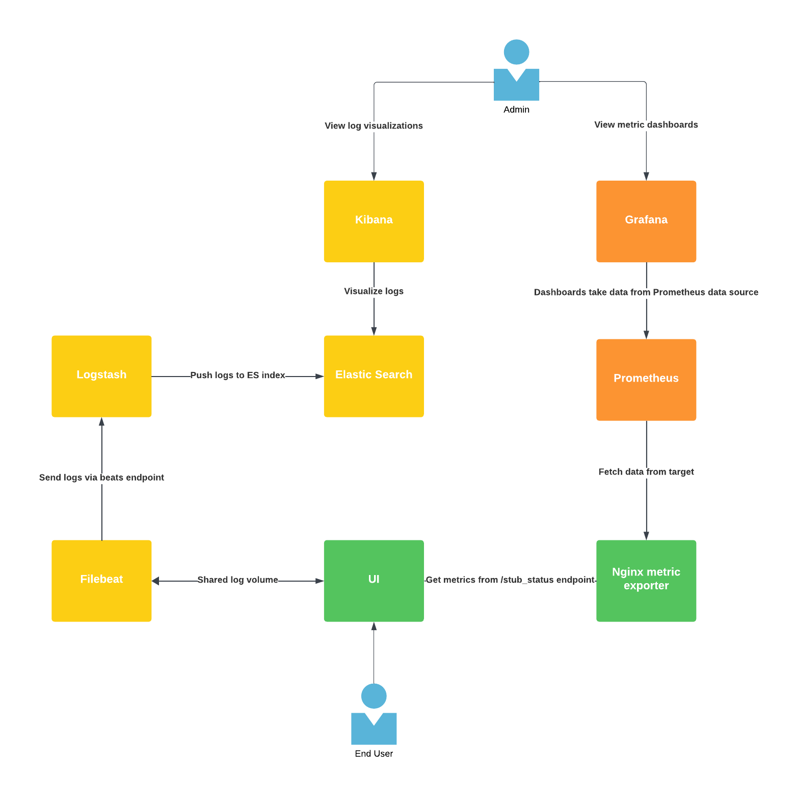

# Application monitoring system

System to monitor metrics and logs of applications running in cloud/k8s environments.

This solution was created by using https://github.com/deviantony/docker-elk template. Please check it out, it's a great template.

## Architecture



System consists of these core elements:
- Traefik - proxy used to connect to containers using hostnames instead of localhost
- Grafana - used to visualize metrics and logs using dashboards
- Prometheus - used to gather metrics
- ElasticSearch - used to index log data
- Logstash - service that collects logs from different sources
- Filebeat - service that sends logs to logstash
- Kibana - used to visualize logs
- Nginx - used to generate some logs and metrics

## How to use
To start run `sh start-docker.sh`
Possible options:
- `--skip-setup` - skips EKL stack role and user creation
- `--clean` - cleans up Docker environment before spinning up containers

### Manual steps
If you want to start system manualy, run this:

Setup to create users and roles:
```
docker-compose up setup
```
Start the stack:
```
docker-compose up
```

### Cleanup
```
docker-compose down -v
```

## Access endpoints and credentials
User passwords can be found in .env file.

Access services using these domains:
- Kibana: http://kibana.docker.localhost<br>
    Username: elastic<br>
    Password: KIBANA_SYSTEM_PASSWORD in .env file<br>
- Grafana: http://grafana.docker.localhost<br>
    Username: admin<br>
    Password: admin<br>
- Prometheus: http://prometheus.docker.localhost<br>
    No auhentication<br>
- Nginx: http://nginx.docker.localhost:4040/<br>
    No auhentication<br>

## Injecting data
If the stack is running, you can manually inject data:
```
# Execute `nc -h` to determine your `nc` version

cat /path/to/logfile.log | nc -q0 localhost 50000          # BSD
cat /path/to/logfile.log | nc -c localhost 50000           # GNU
cat /path/to/logfile.log | nc --send-only localhost 50000  # nmap
```

More details documented in https://github.com/deviantony/docker-elk

By default system collects logs from bookstore sample app.
There is a default data source defined in Grafana, however you need to import dashboard manually from ./grafana/dashboards directory and make it use the created Prometheus datasource. After import data should appear:

